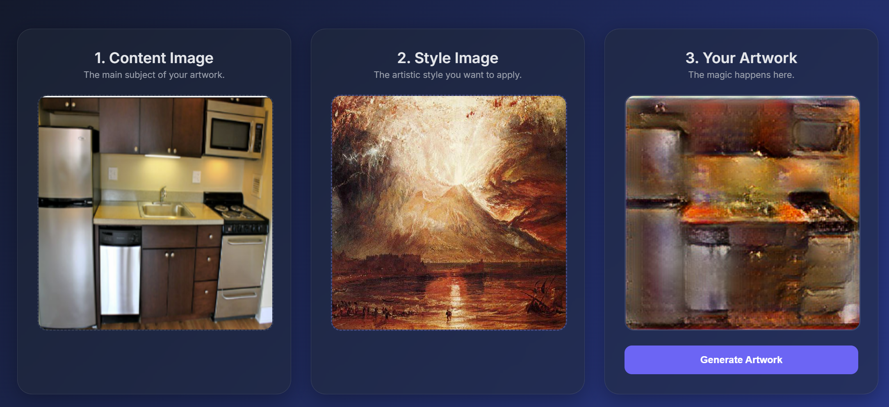

# 🎨 Neural Style Transfer Web Application

This project is a full-stack deep learning web app for **neural style transfer**, letting you blend the content of one image with the artistic style of another in seconds. It uses a high-performance **FastAPI** backend and a clean, responsive frontend.



---

## ✨ Features

✅ **FastAPI Backend** — One powerful Python server for both API and frontend
✅ **Modern UI** — Responsive interface built with HTML, CSS, and vanilla JavaScript
✅ **High-Quality Style Transfer** — Uses TensorFlow/Keras with **Adaptive Instance Normalization (AdaIN)** for smooth, high-res output
✅ **Drag & Drop Upload** — Upload content and style images in seconds
✅ **Easy to Deploy** — Runs locally or on cloud platforms (Render, Railway, Fly.io, etc.)

---

## ⚙️ Tech Stack

* **Backend:** FastAPI, Uvicorn
* **Machine Learning:** TensorFlow / Keras
* **Image Processing:** Pillow, NumPy
* **Frontend:** HTML5, CSS3, JavaScript

---

## 📂 Project Structure

```plaintext
style-transfer-app/
├── app/
│   ├── static/
│   │   ├── index.html      # Main HTML page
│   │   ├── style.css       # Stylesheet
│   │   └── script.js       # Frontend logic
│   ├── model/
│   │   └── stylized_decoder.h5   # Pretrained style transfer model
│   └── main.py             # FastAPI server entry point
├── .gitignore
├── requirements.txt
└── README.md
```

---

## 🚀 Getting Started

Follow these steps to run the project locally.

### ✅ Prerequisites

* Python 3.8+
* An IDE or code editor (e.g., VS Code)
* Basic familiarity with Python virtual environments

---

### 📥 Installation

1️⃣ **Clone the repository**

```bash
git clone https://github.com/YOUR_USERNAME/YOUR_REPOSITORY_NAME.git
cd style-transfer-app
```

2️⃣ **Create & activate a virtual environment**

```bash
# Windows
python -m venv venv
venv\Scripts\activate

# macOS/Linux
python3 -m venv venv
source venv/bin/activate
```

3️⃣ **Install dependencies**

```bash
pip install -r requirements.txt
```

4️⃣ **Add your trained model**

Place your `stylized_decoder.h5` inside:

```
app/model/stylized_decoder.h5
```

---

### ▶️ Run the Application

1️⃣ Navigate to the `app` folder:

```bash
cd app
```

2️⃣ Start the FastAPI server with **Uvicorn**:

```bash
uvicorn main:app --reload
```

3️⃣ Open your browser and visit:
[http://127.0.0.1:8000](http://127.0.0.1:8000)

Your Neural Style Transfer app is now live!

---

## 📝 Tips

* **Deployment:** Easily deploy this app to Render, Railway, or any cloud VM that supports FastAPI.
* **Model Improvements:** Swap in different pretrained style transfer models to experiment with various art styles.
* **Customization:** Extend the frontend with file previews, progress bars, or a gallery of styles.

---

## 📜 License

Feel free to adapt and use this project for educational or personal purposes. Attribution is appreciated!
